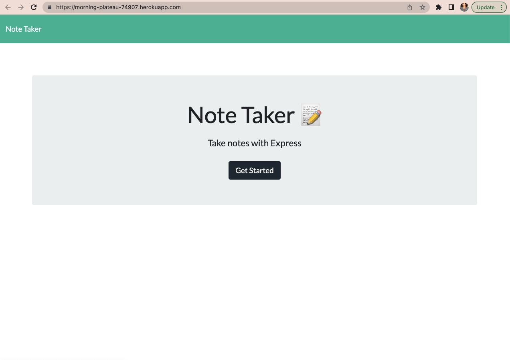
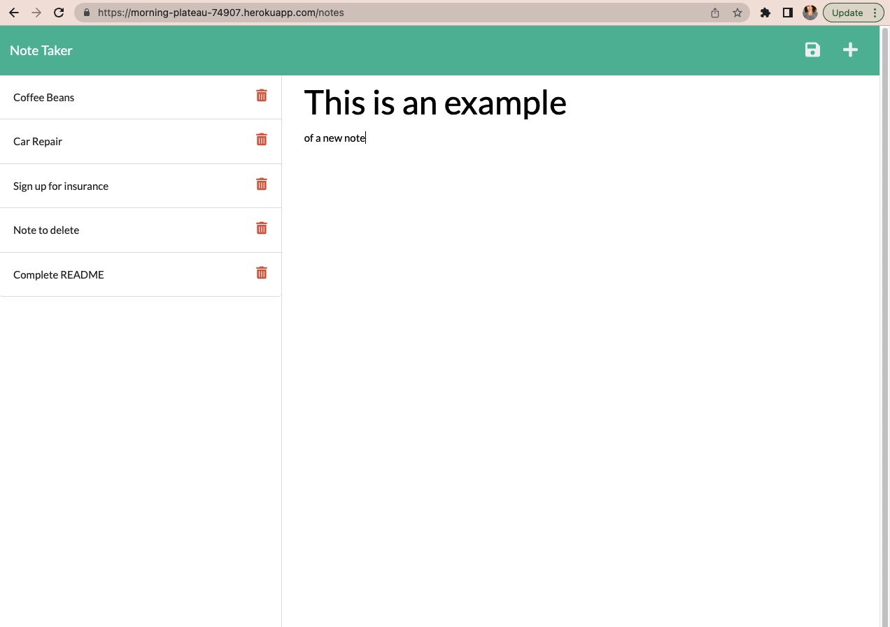

# note-taker-application
  
  ## Description
  This application saves and retrieves notes entered User with the use of Express.js and a JSON file. Starter code for the front end was provided at the onset of this project.

  ## Table of Contents
  
  - [Installation](#installation)
  - [Usage](#usage)
  - [Credits](#credits)
  - [License](#license)
  - [Contributing](#contributing)
  - [Tests](#tests)
  - [Questions](#questions)
  
  ## Installation
  Install by visiting this link https://morning-plateau-74907.herokuapp.com/.
  
  ## Usage
  Once the application is opened in the browser, User will be presented with intro page and a "Get Started" button that, when clicked, will lead to the page where notes (titles and text) can be entered. To add a note, User will click on "Note Title" and "Note Text" fields to type data. Once User begins to type into the "Note Text" field a save disk icon will appear in the upper right corner along the navigation bar. Once the disk is clicked the newly entered note will appear in the left column where it will remain until deleted by User. Currently, the red trash/delete icon does not have deletion capabilities.

  
  

  ## Credits
  Lindsay Lewis is credited with collaboration, https://github.com/lindslewis. This application utilizes Express.js, npm (nodemon) Node.js, JSON, HTML, CSS, JavaScript, Heroku and GitHub.

  ## License

  Not under license
  
  ## Contributing
   Please review the [Contributor Covenant](https://www.contributor-covenant.org/) for guidlines on how to contribute to this application.
  
  ## Tests
  At this time, no tests have been written for this application.

  ## Questions

  If you have any questions about the repo, you can open an issue or contact me directly at: stephaniemariagomez@gmail.com. See more of my work at https://github.com/smariagomez.